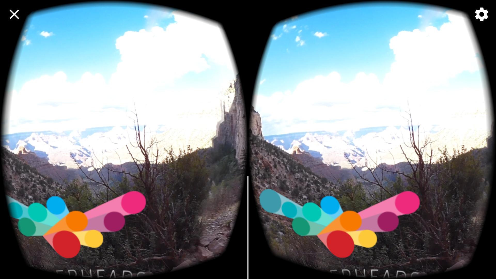

# The-Storyteller-s-Revenge

This is a project which depicts a traveler with a friend at the Grand Canyon testing the echo of the mountains. In the video, they are fascinated by the echo they hear from the canyon and mountain range so they try different tactics to provoke it. GVR SDK 1.0.3. was used, Pix Pro 360, Adobe Premiere, AV Pro workaround (with watermark) and Unity AV Player.

__Introduction__

__Development Process__

I began with downloading Jessica's videos from Dropbox and by researching some of her Grand Canyon which I liked. Then I stitched two 180 videos using Pix Pro 360 software in order to ingest into Adobe Premiere. A title and an official credit section were added. 

__User Testing__

I launched the Unity app I created on my LG Nexux Android smartphone and put it into a cardboard viewer. The non-edited 50 second long video was clear and had a smooth transition between character movements. I was able to upload the video to YouTube and watch it in 360 format. For some reason though, the adjuster to toggle the 360 view disappeared from the top left-hand corner after watching the video a couple of times. 

__Breakdown of Final Piece__

__Conclusion__
This 52 second video eventually got condensed to 30 seconds and included an intro, some music in the background and ending credits.
